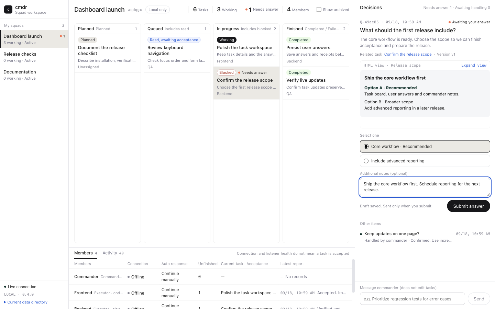
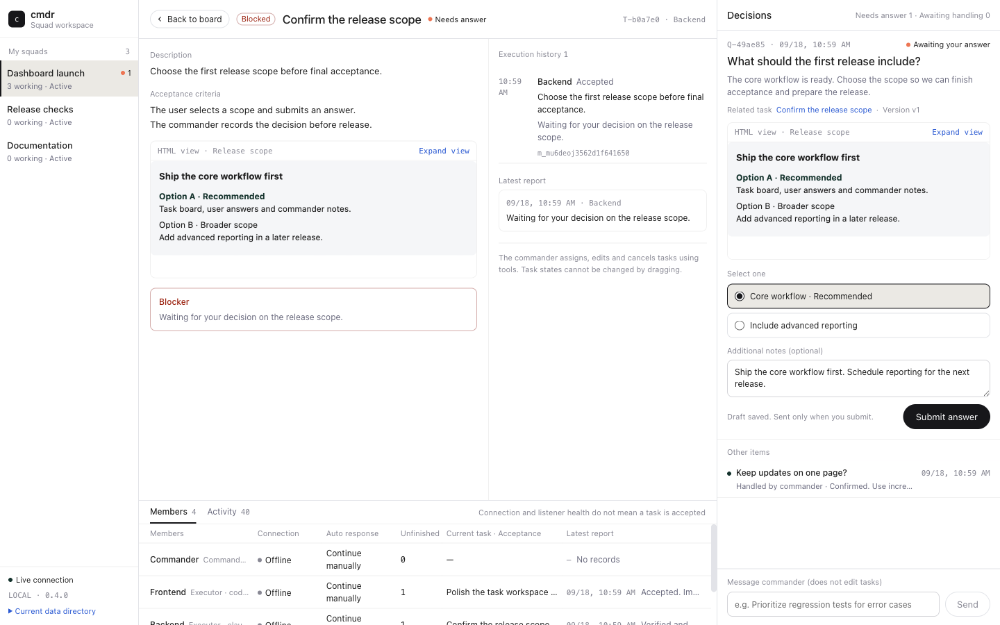

# cmdr

**Local squads for coding agents.** Connect existing Claude Code, Codex, ZCode, Kimi Code and other MCP-capable Agent sessions. A commander dispatches tasks; executors report progress and ask questions. Messages persist in SQLite and arrive in priority order.

[中文说明](docs/README.zh-CN.md) · [Design specification](docs/cmdr-design-v1.md) · [Host integration](docs/agent-integration.md) · [Implementation and verification](docs/implementation.md)

## Quick start

Requires macOS or Linux and **Node.js ≥22.5** (24 recommended). The development branch contains source and plugin metadata. npm packages and the generated `marketplace` branch include the runtime bundles.

**One-command setup (0.5.0):** replace `claude-code` with `codex`, `zcode` or `kimi-code` for your host.

```sh
npx -y --package=cmdr-mcp@latest cmdr setup --agent claude-code
```

Setup installs the runtime, skill, MCP and hooks while preserving existing settings. Repeat to upgrade; add `--dry-run` to preview. Open a new session and complete any host trust prompts. For a built checkout, use `plugins/cmdr/bin/cmdr setup --agent …`.

For skill files only:

```sh
npx skills add njugray/cmdr --skill cmdr
```

The skill requires a working cmdr runtime and MCP connection. Use setup or the native plugin below for those components. See [installation details](docs/setup.md).

The npm package is **`cmdr-mcp`**; the CLI and host plugin remain **`cmdr`**. For a global CLI and native plugin installation:

```sh
npm install --global cmdr-mcp
cmdr --help
```

For a source checkout, build before registering the marketplace:

```sh
npm ci
npm run build
```

For distribution, `npm pack` (or `npm publish`) runs `prepack` to build the four entry points and include them, plugin assets and license notices in the package. The package has no external runtime dependencies:

```sh
npm pack
npm install --global ./cmdr-mcp-0.5.0.tgz
cmdr --help
```

Use the built checkout root, or the installed package root (`$(npm root -g)/cmdr-mcp`), as `/path/to/cmdr` below. A raw Git marketplace checkout without a build is not a runnable distribution. See [Publishing](docs/publishing.md) for release preparation and publication.

**Claude Code**

```sh
claude plugin marketplace add /path/to/cmdr
claude plugin install cmdr@cmdr
```

**Codex**

```sh
codex plugin marketplace add /path/to/cmdr
codex plugin add cmdr@cmdr
```

Enable Codex hooks and trust the five cmdr hooks when prompted. Without hooks, the tools still work through long polling. Confirm `codex mcp list` includes cmdr and start a new session.

**ZCode desktop**

Open a workspace, then **Settings → Plugins → Create → Add plugin marketplace**. Enter **`njugray/cmdr#marketplace`**, install **cmdr**, and start a new session. This release branch includes the complete runtime: no global npm install or local build is required. Node.js ≥22.5 is still required. The maintainer must publish the branch once using the **Publish marketplace** workflow before this source is available.

The native `.zcode-plugin` manifest sets up MCP, commands and skills; ZCode discovers the four supported lifecycle hooks automatically. Local developers can still select a built checkout or installed npm package root. See [ZCode setup and verification](docs/agent-integration.md#zcode-desktop).

**Kimi Code desktop**

Run `npx -y --package=cmdr-mcp@latest cmdr setup --agent kimi-code`, then restart the Kimi Code app (its hook executor caches `config.toml` at startup). Setup writes the cmdr MCP server into `~/.kimi-code/mcp.json`, five lifecycle hooks into `~/.kimi-code/config.toml` and links the `cmdr` and `cmdr-identity` skills into `~/.kimi-code/skills/`. Kimi pools one MCP process per workspace, so every cmdr call must carry your session identity: the `cmdr-identity` skill renders your real session id (`${KIMI_SESSION_ID}`) and instructs the model to pass it as `_cmdr_session` on every call. The native `.kimi-plugin` manifest declares MCP, commands, skills and the same hooks for installation through the host plugin manager, with `sessionStart.skill` injecting the identity skill into every new or resumed session. See [Kimi Code setup and verification](docs/agent-integration.md#kimi-code-desktop).

**Other Agents**

Use any MCP stdio client. Generate a configuration with an absolute executable path:

```sh
/path/to/cmdr/plugins/cmdr/bin/cmdr config --agent my-agent
```

Merge the printed `mcpServers` entry into your host configuration. No proprietary plugin or hook API is required. The [integration guide](docs/agent-integration.md#other-mcp-hosts) covers identity, timeouts, multiplexed sessions and optional hooks.

In each participating session, enter:

```text
/cmdr my-project
```

Joining by name atomically creates or finds a persistent channel and defaults to executor, including the first member. Explicitly ask one session to command it: `join(role="commander", squad_name="my-project", standby="auto")`. Channels remain joinable without a commander; their ID survives ordinary departures and daemon restarts. This is a behavior change from 0.1.x.

## Workflow

1. Executors join and `report(status="ready")` with their cwd, capabilities and context.
2. The commander inspects `list`, then `send`s clear tasks with acceptance criteria.
3. Executors `read`, immediately acknowledge with `report(status="working", reply_to=<command id>)`, do the work, then report done/failed/cancelled with the same `reply_to`.
4. Executors use `ask` when blocked; the commander responds with `send(type="answer", reply_to=<ask id>)`.
5. Use `join(..., standby="auto")`. Claude/ZCode/Kimi then arm `listener.arm.command` with its indicated native tool. Inspect `list` for listener health. With `can_auto_respond=true`, end the idle turn. Unsupported hosts remain manual; the skills bound fallback polling to two waits and explain manual continuation.
6. `leave` preserves queued messages. Commander departure orphans the squad; `leave(dissolve=true)` disbands it.

Codex wakes through app-server proxy or the `codex queue` fallback. Claude uses Monitor; ZCode and Kimi Code use background Bash completion through the built-in `cmdr standby watch`; re-arm after task termination. See [Long-running collaboration](docs/long-running-collaboration.md) for capabilities, recovery, handover and compatibility requirements.

## Tools

Exactly nine MCP tools are exposed, independently of the host:

| Tool       | Purpose                                                                                  |
| ---------- | ---------------------------------------------------------------------------------------- |
| `join`     | Atomic join/create by `squad_name`, or explicit `role` and squad ID                      |
| `list`     | Task ownership, unacknowledged age, progress, connection state and listener health       |
| `send`     | Commands, cancel, answers and info; task_key deduplication and gated reassign            |
| `report`   | Executor ready, working, blocked, done, failed or cancelled reports                      |
| `ask`      | Executor questions, or commander `target=user` dashboard questions and handling receipts |
| `read`     | Priority dequeue, peek/history, recover, ID lookup and long polling                      |
| `leave`    | Leave, orphan or dissolve a squad                                                        |
| `task`     | Create, update, query and archive persistent dashboard tasks                             |
| `artifact` | Publish/query isolated HTML explanations for tasks and questions                         |

Every successful tool result includes identity, recommended wait and unread count. Reports carry their status in `message.data.status`. Unread messages are retained across daemon restarts; reads mark them delivered and leave history. Delivery is distinct from acceptance and completion. `read(recover=true)` non-destructively lists all unfinished commands, including already-read work. `pending=0`, `unread=0` and `offline` never release task ownership. `read`/`list` are compact by default; use `full=true` for expanded metadata. ID lookups also enforce the reassignment gate before exposing queued replacement work. Listings never include command bodies; use `read(id=...)` for your own inbox or operator `tail --full` for observation. No exactly-once execution guarantee is made.

## Local dashboard

Run `cmdr dashboard` (or the stable CLI path printed by setup) to open the built-in React dashboard. `--no-open` prints short-lived access URLs for `127.0.0.1` and the machine’s non-loopback IPv4 addresses. The server binds to `0.0.0.0` on a system-assigned port; each address has its own single-use token, so opening the local link does not consume the LAN links. One page switches between squads, with a task workspace, a member/activity dock, and a persistent confirmation panel. Users can submit structured answers or send a note to the selected squad’s commander; notes enter the existing user-message queue without directly changing tasks. The HTTP/SSE service runs inside the existing daemon; closing the page does not stop collaboration.

Dashboard UI copy follows the system/browser’s preferred language: Chinese (`zh-*`) uses Simplified Chinese; other languages use English. Agent/user content and HTML artifacts remain unchanged. Reload after changing the browser language.

Example dashboard with demo data: multiple squads, task progress, member status, HTML explanations and user answers. Agent content in this example was written in English; it is not automatically translated.



<details>
<summary>Task details with the answer form kept open</summary>



</details>

[View the Chinese dashboard example](.github/assets/dashboard/main.jpg).

Commanders create tasks with `task(action="create", title=...)`, dispatch using `send(task_id=..., to=..., message=...)`, and ask the user with `ask(target="user", question=..., kind="single|multiple|text|confirm")`. Answers enter the stable commander inbox; explicitly use `ask(target="user", action="handle", id=..., version=..., result=...)` after processing. `artifact` publishes self-contained sandboxed HTML explanations. See [dashboard operations and limits](docs/dashboard.md).

## Installation diagnostics and member CLI

If cmdr tools are absent, inspect the host's actual plugin cache with `cmdr doctor --plugin-root /path/to/cached/plugin`. Add `--deep` to check MCP and daemon access in a temporary state directory. The checker works even when the inspected CLI bundle is missing. Refresh/reinstall damaged caches from the complete npm package and start a new session.

`cmdr session join|list|send|report|ask|read|leave|task|artifact` provides member operations when MCP tools are unavailable. Supply `--agent` and `--native-id` (or `CMDR_AGENT`/`CMDR_SESSION_ID`); use the same native ID as the host. These commands retain membership and messages after exit, and display connection presence as `cli`; execution state is reported separately.

```sh
cmdr session join --agent zcode --native-id YOUR_SESSION_ID --squad-name my-project
cmdr session read --agent zcode --native-id YOUR_SESSION_ID --wait 45
```

See [Troubleshooting and CLI examples](docs/troubleshooting.md) for role-specific operations, identity rules, cancellation and diagnostic limitations.

## Operator CLI

```sh
plugins/cmdr/bin/cmdr status
plugins/cmdr/bin/cmdr list --all
plugins/cmdr/bin/cmdr tail --follow --json --full --after 0
plugins/cmdr/bin/cmdr standby status --session <sid>
plugins/cmdr/bin/cmdr send --squad <id> --to tests "Run the test suite"
plugins/cmdr/bin/cmdr read --session <sid> --peek
plugins/cmdr/bin/cmdr daemon start
plugins/cmdr/bin/cmdr daemon restart
plugins/cmdr/bin/cmdr doctor
plugins/cmdr/bin/cmdr config --agent zcode
plugins/cmdr/bin/cmdr purge
```

`purge --all` deletes all cmdr data, including active memberships and queues. Normal `purge` only expires old data. `tail --full` includes complete bodies and attachments; default output truncates bodies. Read-only commands do not start the daemon.

State is under `~/.cmdr/`; `CMDR_HOME` overrides it. The directory is 0700 and the Unix socket is 0600. Optional `config.json`:

```json
{
  "ttlDays": 7,
  "idleExitMinutes": 30,
  "remindIntervalSec": 300,
  "maxQueue": 1000,
  "rateLimitPerMinute": 60
}
```

The daemon keeps queues, role membership, global message order and history in SQLite (WAL). Hooks expose only message metadata, never message bodies; Stop blocks only on actionable unread messages and is throttled. Queue caps and rate limits provide backpressure. Each command reserves admission for its first correlated terminal report, so a full role inbox cannot roll back completion; ordinary and repeated reports remain capped. Automatic daemon replacement is disabled. `cmdr daemon restart` validates this bundle against a consistent database copy before stopping the old daemon. `doctor` lists connected client versions and listener health. The 0.2 daemon rejects cached 0.1.x clients at handshake; refresh/reinstall the plugin cache and reconnect the host.

## Why MCP instead of terminal orchestration?

[cmux](https://github.com/manaflow-ai/cmux) and [herdr](https://github.com/herdrdev/herdr) organize agents through terminal workspaces and process lifecycle. cmdr attaches coordination to an Agent session: typed messages, persistent delivery state, explicit roles and host lifecycle hooks. Desktop sessions do not need a tty or terminal pane. You can also use cmdr within a terminal manager.

## Development

```sh
npm ci
npm run check
npm run verify:zcode   # optional: requires the locally installed ZCode desktop runtime
```

`npm run check` checks formatting/types, builds the four entry points, runs unit/real-process tests, then packs and installs the npm tarball offline in a temporary prefix to verify the CLI and nine MCP tools. CI runs on macOS/Linux with Node 22/24 and checks generated bundles are not tracked by Git. The optional ZCode check validates, installs and connects the plugin using an isolated desktop runtime, without making a model request.

For development, `claude --plugin-dir ./plugins/cmdr` loads the plugin directly. Installed hosts use cached copies: reinstall/refresh after changing a plugin. Version numbers come from `package.json`; after same-version changes, restart the daemon explicitly. Generated bundles and third-party license notices are ignored by Git and included in the npm package.

v1 is single-machine, single-user, Unix-socket-only. There is no network listener, remote transport or executor-to-executor messaging. Agent session creation is outside the current scope. Host GUI interaction and live model behavior are distinct from the automated runtime checks; see the [verification record](docs/implementation.md).

[MIT](LICENSE)
